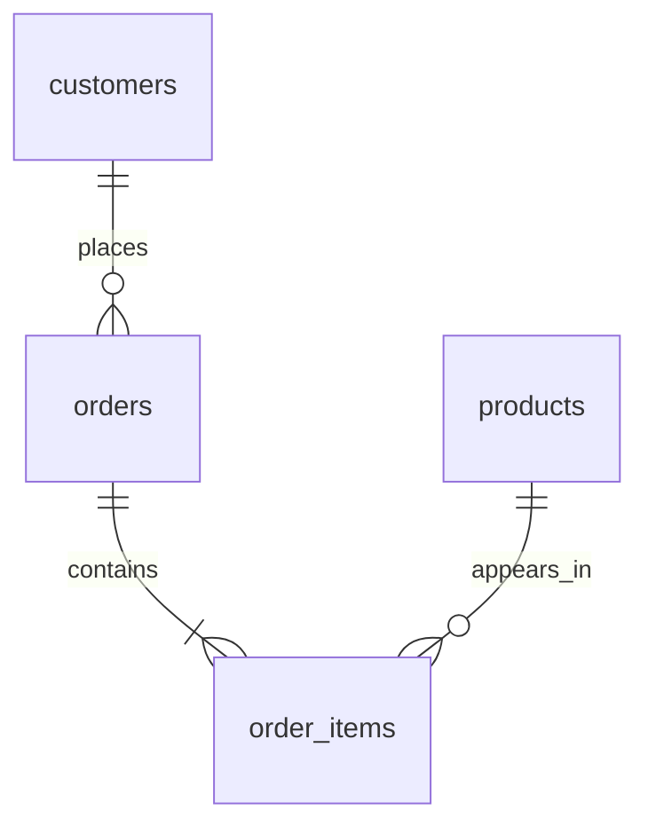

# Retail Sales & Customer Retention Analysis

A reproducible SQL portfolio project for a fictional online retailer, covering January 2024 through December 2025.

**Business question:** Where does revenue and product profit come from, and how consistently do customers return?

**Tools:** SQLite, SQL, and Python's standard library for generating data and running queries. No external packages, account, or paid service required.

**Dataset:** 1,200 customers, 20 products, 5,479 orders, and 13,801 order lines. Delivered orders produce $559,427.20 in simulated revenue, a $115.90 average order value, and a 76.74% observed repeat customer rate. See the findings for interpretation and limitations.

**Data disclosure:** All records are synthetic, generated with seed 42. Names describe fictional products; there is no personal customer information. Growth, seasonality, and differences in customer purchase frequency are deliberately modeled. Results demonstrate analytical technique and do not represent real business outcomes. This project was built with AI assistance.

## Start here

1. Read [the business findings](docs/findings.md).
2. Follow [the beginner walkthrough](docs/walkthrough.md).
3. Review the annotated queries in [sql](sql/).
4. Read [metric definitions and data dictionary](docs/data_dictionary.md).

The ready-to-use database is `retail.db`. The `results/` directory contains the actual query outputs as CSV files. The `data/` directory contains the four source tables as CSV files.

## Run it

**Windows shortcut:** Double-click `Run Project.cmd`. It rebuilds the database and analyses and leaves the results visible in the window. It uses an installed Python launcher, Python, or the bundled Codex Python runtime when available. This replaces generated files, so save your query edits first. Open the CSV files in `results/` to inspect the output.

With Python 3.10 or newer, open a terminal in this project folder:

```sh
python build_project.py
```

On Windows, `py build_project.py` also works if your Python installation uses the launcher. The script generates source data, recreates the database, runs all ten analyses, exports results, and checks their consistency. It uses only Python's standard library. Running it again replaces the generated data, SQL, database, findings, and results in this folder. Preserve any edits before rebuilding. To change a generated analysis permanently, edit its SQL inside `build_project.py`.

To run one SQL file independently:

```sh
python run_query.py sql/02_monthly_growth_analysis.sql
```

Alternatively, open `retail.db` in a SQLite-compatible database editor, open an analysis SQL file, and execute it. The schema file drops and recreates the tables and is **not** an analysis query; running it alone empties the database. These queries target SQLite rather than SQL Server, MySQL, or PostgreSQL; their date functions differ.

## Data model



An order can contain multiple products. The `delivered_order_totals` view rolls line items into one row per delivered order before calculating order-level metrics. That protects order counts and average order value from accidental inflation.

## Analyses and demonstrated skills

| Query | Business question | SQL techniques |
|---|---|---|
| 01 Overall KPIs | How large and profitable is the business? | Aggregation, DISTINCT, NULLIF |
| 02 Monthly growth | How is revenue changing? | Recursive calendar CTE, LEFT JOIN, LAG |
| 03 Category profitability | Which categories contribute profit? | Multi-table joins, calculated metrics |
| 04 Top products | What leads each category? | DENSE_RANK, partitioned ranking |
| 05 Repeat purchase | How many purchasers return? | CTE, conditional aggregation |
| 06 Customer segments | Which repeat customers are active or lapsed? | CASE, recency, frequency, spend |
| 07 Cohort retention | Do first-purchase cohorts return in later months? | Recursive CTE, cohort grid, distinct activity |
| 08 Regional performance | How do regions compare? | LEFT JOIN, customer-level aggregation |
| 09 Order outcomes | What share is cancelled or refunded? | Subquery, percentages |
| 10 Customer concentration | How much revenue comes from the top 10%? | ROW_NUMBER, window counts |

## Validation

The build runs database integrity and foreign-key checks, checks signup chronology and nonempty orders, reconciles revenue against source records and grouped outputs, and verifies cohort bounds and month-zero retention. See [validation output](results/validation.txt). Additional small-fixture tests for tricky query behavior can be run with `python test_queries.py`.

## Portfolio use

Create a GitHub repository named `retail-sql-analysis`, then upload the contents of this folder. GitHub will display this README on the repository's front page. Include the database and CSVs so reviewers can inspect the work without rebuilding it. Before posting, review [the presentation guide](docs/portfolio_guide.md) and learn to explain the revenue definition, table relationships, and retention query.

Suggested extensions to complete yourself: add a 90-day repeat-purchase metric with equal observation windows, compare year-over-year revenue, or adapt the model to a public real-world dataset with documented source and license.
