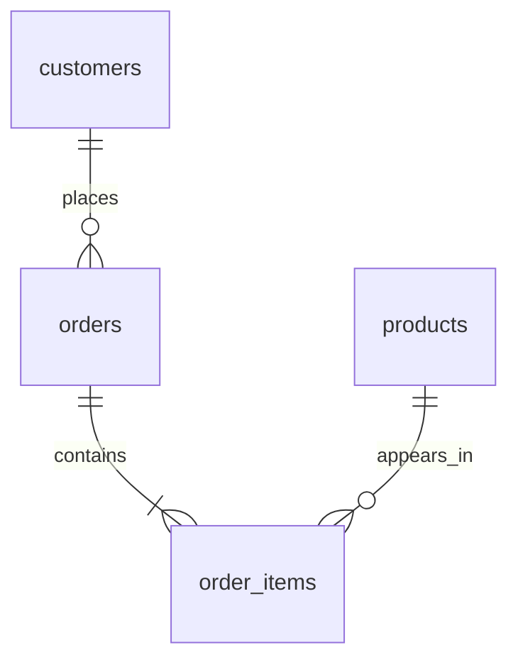

# Retail Sales & Customer Retention Analysis

A SQL project on a made-up online retailer. The question: where does the money come from, and do customers come back?

Built with SQLite and plain Python. Covers January 2024 to December 2025.

## The data

- 1,200 customers, 20 products, 5,479 orders
- $559,427.20 in revenue from delivered orders
- $115.90 average order value
- 76.74% of customers made a repeat purchase

Everything is synthetic, generated with seed 42, so there's no real customer info. I built in growth, seasonality, and different buying habits so there'd be patterns to find. The results show how I work with SQL, not how a real business performed. I used AI assistance while building this.

## Where to look

- [Findings](docs/findings.md) for what the analysis showed
- [Walkthrough](docs/walkthrough.md) for how the queries work
- [sql](sql/) for the annotated queries
- [Data dictionary](docs/data_dictionary.md) for metric definitions

The database is `retail.db`, query outputs are in `results/`, and the source tables are in `data/`.

## Run it

You need Python 3.10 or newer.

```sh
python build_project.py
```

This rebuilds the data, database, and all ten analyses, then checks the numbers. It overwrites generated files, so save any edits first. On Windows you can also double-click `Run Project.cmd`.

To run one query:

```sh
python run_query.py sql/02_monthly_growth_analysis.sql
```

Don't run the schema file on its own. It wipes the database. The queries are written for SQLite, so date functions would need changes for other databases.

## Data model



The `delivered_order_totals` view rolls line items up to one row per delivered order, so order counts and average order value don't get inflated.

## The ten analyses

| Query | Question | SQL used |
|---|---|---|
| 01 Overall KPIs | How big and profitable is the business? | Aggregation, DISTINCT, NULLIF |
| 02 Monthly growth | How is revenue changing? | Recursive CTE, LEFT JOIN, LAG |
| 03 Category profitability | Which categories bring in profit? | Multi-table joins |
| 04 Top products | What sells best in each category? | DENSE_RANK |
| 05 Repeat purchase | How many buyers return? | CTE, conditional aggregation |
| 06 Customer segments | Who is active and who has lapsed? | CASE, recency, frequency |
| 07 Cohort retention | Do customers keep buying after their first month? | Recursive CTE, cohort grid |
| 08 Regional performance | How do regions compare? | LEFT JOIN, aggregation |
| 09 Order outcomes | What share is cancelled or refunded? | Subquery, percentages |
| 10 Customer concentration | How much revenue comes from the top 10%? | ROW_NUMBER, window counts |

##
