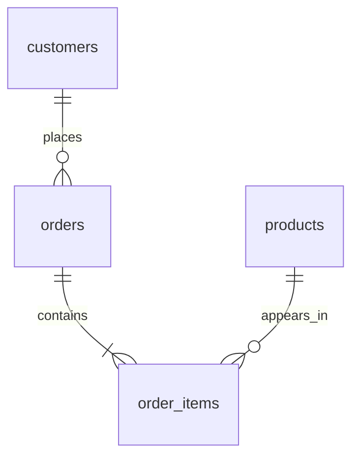

# Retail Sales & Customer Retention Analysis

I built this SQL project around a made-up online retailer to answer one question: where does the money come from, and do customers actually come back?

It covers January 2024 through December 2025 and uses SQLite with plain Python. No packages, accounts, or paid tools needed.

## What's in the data

- 1,200 customers
- 20 products
- 5,479 orders and 13,801 order lines
- $559,427.20 in revenue from delivered orders
- $115.90 average order value
- 76.74% of customers came back for a repeat purchase

## A quick note on the data

Everything here is synthetic. I generated it with a fixed seed (42), so there's no real customer information, and the product names are invented. I built in growth, seasonality, and differences in how often customers buy so the analysis would have something real to find. That means the results show how I work with SQL, not how a real business performed. I also used AI assistance while building this.

## Where to start

1. Read the [business findings](docs/findings.md) to see what the analysis turned up.
2. Follow the [beginner walkthrough](docs/walkthrough.md) if you want to see how the queries work.
3. Browse the annotated queries in the [sql](sql/) folder.
4. Check the [data dictionary](docs/data_dictionary.md) for metric definitions.

The finished database is `retail.db`. Query outputs are in `results/` as CSVs, and the four source tables are in `data/`.

## Running it yourself

On Windows, double-click `Run Project.cmd`. It rebuilds everything and shows the results in the window. Heads up that this overwrites generated files, so save any query edits first.

Otherwise, with Python 3.10 or newer, open a terminal in the project folder and run:

```sh
python build_project.py
```

If you're on Windows and that doesn't work, try `py build_project.py`. The script generates the data, rebuilds the database, runs all ten analyses, exports the results, and checks that the numbers add up. Running it again replaces everything it generated, so if you want to change an analysis for good, edit the SQL inside `build_project.py`.

To run a single query:

```sh
python run_query.py sql/02_monthly_growth_analysis.sql
```

You can also open `retail.db` in any SQLite-friendly database editor and run the SQL files from there. Don't run the schema file on its own. It drops and recreates the tables, which wipes the database. These queries are written for SQLite, so date functions will need changes for SQL Server, MySQL, or PostgreSQL.

## How the data fits together



One order can have several products. To keep order counts and average order value from getting inflated, the `delivered_order_totals` view rolls line items up to one row per delivered order before any order-level math happens.

## The ten analyses

| Query | What I wanted to know | SQL used |
|---|---|---|
| 01 Overall KPIs | How big and profitable is the business? | Aggregation, DISTINCT, NULLIF |
| 02 Monthly growth | How is revenue changing over time? | Recursive calendar CTE, LEFT JOIN, LAG |
| 03 Category profitability | Which categories bring in the profit? | Multi-table joins, calculated metrics |
| 04 Top products | What's the best seller in each category? | DENSE_RANK, partitioned ranking |
| 05 Repeat purchase | How many buyers return? | CTE, conditional aggregation |
| 06 Customer segments | Which repeat customers are active and which have lapsed? | CASE, recency, frequency, spend |
| 07 Cohort retention | Do customers from the same first month keep buying? | Recursive CTE, cohort grid |
| 08 Regional performance | How do regions stack up? | LEFT JOIN, customer-level aggregation |
| 09 Order outcomes | What share gets cancelled or refunded? | Subquery, percentages |
| 10 Customer concentration | How much revenue comes from the top 10% of customers? | ROW_NUMBER, window counts |

## How I checked my work

Every build runs integrity and foreign key checks, makes sure customers signed up before they ordered, and confirms no order is empty. It also matches revenue against the source records and the grouped outputs, and checks cohort bounds and month-zero retention. The results are in [validation output](results/validation.txt). For the trickier query logic, I wrote some small test cases you can run with `python test_queries.py`.

## Using this in a portfolio

If you want to reuse this, make a GitHub repo called `retail-sql-analysis` and upload everything in this folder. GitHub shows this README on the front page. I'd keep the database and CSVs in there so people can look around without rebuilding anything.

Before you share it, read through the [presentation guide](docs/portfolio_guide.md). You should be able to explain how revenue is defined, how the tables connect, and how the retention query works, since those are the things people are most likely to ask about.

## What I'd add next

- A 90-day repeat purchase metric, so every customer gets the same amount of time to come back
- A year-over-year revenue comparison
- A version built on a real public dataset, with the source and license documented
